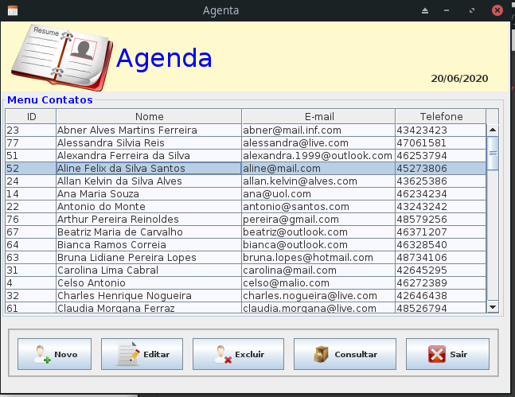
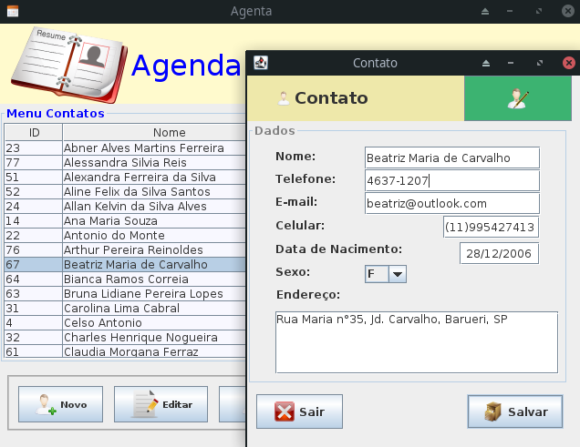

# Projeto JAgenda




 Agenda de contatos feita em JAVA e banco de dados MS Access

## Execução

 Para utilizar o sistema agenda só e necessario baixar o ```agenda.jar```, ```config.json``` e o ```bancoagenda.accdb```.
 Depois disso coloque os 3 arquivos na mesma pasta e execute o ```agenda.jar```.
 * Observe que a localização do ```.accdb```(banco de dados) pode ser alterada pelo arquivo ```config.json```
 ```
 java -jar agenda.jar
```
## Bibliotecas

* [Swing](https://pt.wikipedia.org/wiki/Swing_(Java)) - Plataforma para desenvolvimento Desktop multiplataforma com Java
* [Ucanaccess](http://ucanaccess.sourceforge.net/site.html) - Biblioteca para conexão com o banco de dados Microsoft Access

